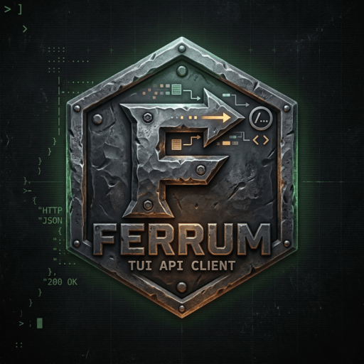

# ferrum

<p align="center">
  
</p>

A terminal-based HTTP client. Think Postman, but in your terminal.

Built with Rust and [ratatui](https://github.com/ratatui/ratatui).

```
┌─Collections──┬─GET ▼─┬─ https://{{BASE_URL}}/users ─────────────────┐
│ ▾ My API     │       │ [Headers] [Body] [Params] [Auth]              │
│   GET /users │       │                                               │
│   POST /user │       │                                               │
│ ▸ Other API  ├───────┴─ Response ────────────────────────────────────│
│              │ 200 OK  •  142ms  •  1.2 KB                           │
│              │ [Body] [Headers] [Raw]                                 │
│              │ {                                                      │
│              │   "users": []                                          │
│              │ }                                                      │
└──────────────┴────────────────────────────────────────────────────────┘
```

## Features

- Organize requests into collections with folders
- Environment variables with `{{VAR}}` interpolation in URLs, headers, and body
- Bearer token, Basic Auth, and API key authentication
- Syntax-highlighted JSON responses via syntect
- Request history (last 500 entries, credentials never persisted)
- Vim-style keyboard navigation
- Saves everything to `~/.config/ferrum/` as JSON

## Install

Ferrum is built from source using Rust. All platforms need [Rust](https://rustup.rs) installed first:

```bash
curl --proto '=https' --tlsv1.2 -sSf https://sh.rustup.rs | sh
```

The `ferrum` binary will be placed in `~/.cargo/bin/`. Make sure that's in your `PATH`:

```bash
# Add to ~/.bashrc, ~/.zshrc, or ~/.profile if not already present
export PATH="$HOME/.cargo/bin:$PATH"
```

### macOS

No extra dependencies needed.

```bash
git clone https://github.com/yourusername/ferrum
cd ferrum && cargo install --path .
```

### Ubuntu / Debian

```bash
# Install build dependencies
sudo apt install -y build-essential pkg-config libssl-dev

git clone https://github.com/yourusername/ferrum
cd ferrum && cargo install --path .
```

### Arch Linux

```bash
git clone https://github.com/yourusername/ferrum
cd ferrum && cargo install --path .
```

#### Omarchy / Hyprland

To open ferrum with a keybinding, add to `~/.config/hypr/userprefs.conf`:

```
bind = $mainMod, F, exec, ghostty -e ferrum
```

### Update

```bash
cd ferrum && git pull && cargo install --path . --force
```

## Usage

Launch with:

```bash
ferrum
```

### Quickstart

1. Press `n` to create a collection
2. Press `N` to add a request to it
3. Press `Enter` or `l` on the request to open it
4. Press `Tab` to move focus to the URL bar, then `i` to type the URL
5. Press `Enter` to send

### Keyboard Shortcuts

#### Global

| Key | Action |
|-----|--------|
| `Tab` / `Shift-Tab` | Cycle focus: Sidebar → URL → Request → Response |
| `q` / `Ctrl-C` | Quit |
| `?` | Help |
| `e` | Environment editor |

#### Sidebar

| Key | Action |
|-----|--------|
| `j` / `k` | Navigate up / down |
| `l` / `Enter` | Expand collection or open request |
| `h` | Collapse collection |
| `n` | New collection |
| `N` | New request in current collection |
| `d d` | Delete (shows confirm dialog) |

#### URL Bar (focus with `Tab`)

| Key | Action |
|-----|--------|
| `i` | Enter insert mode to type |
| `Esc` | Exit insert mode, save |
| `Enter` | Send request |
| `m` | Focus method selector |

#### Method Selector

| Key | Action |
|-----|--------|
| `j` / `k` | Cycle method (GET, POST, PUT, PATCH, DELETE…) |
| `Enter` / `Esc` | Confirm and return to URL |

#### Request Tabs (Headers, Body, Params, Auth)

| Key | Action |
|-----|--------|
| `[` / `]` | Previous / next tab |
| `1` `2` `3` `4` | Jump to Headers / Body / Params / Auth |

#### Headers and Params Tables

| Key | Action |
|-----|--------|
| `o` | Add new row |
| `Enter` | Edit selected row (Tab moves key → value) |
| `d d` | Delete row |
| `Space` | Toggle row enabled / disabled |
| `Esc` | Cancel edit |

#### Response Panel

| Key | Action |
|-----|--------|
| `j` / `k` | Scroll body |
| `[` / `]` | Switch Body / Headers / Raw tab |

#### Environment Editor (`e`)

| Key | Action |
|-----|--------|
| `n` | New environment |
| `o` | Add variable to current environment |
| `Enter` | Edit selected variable |
| `a` | Set as active environment |
| `j` / `k` | Navigate environments |
| `J` / `K` | Navigate variables |
| `Esc` | Close |

## Environment Variables

Use `{{VAR_NAME}}` anywhere in a URL, header value, or request body:

```
https://{{BASE_URL}}/api/users
Authorization: Bearer {{TOKEN}}
```

Open the environment editor with `e`, create an environment, add your variables, and press `a` to activate it. All `{{VAR}}` placeholders are replaced at send time.

## Config and Data

Everything is stored in `~/.config/ferrum/`:

```
~/.config/ferrum/
├── collections/    # one JSON file per collection (named by UUID)
├── environments/   # one JSON file per environment (named by UUID)
└── history.json    # last 500 requests (no credentials stored)
```

Auth credentials (tokens, passwords, API keys) are **never written to disk** — they live only in the collection file attached to the saved request config, and are stripped from request history.

## Building from Source

```bash
cargo build --release
# binary at target/release/ferrum
```

Requires Rust 1.75 or later.
